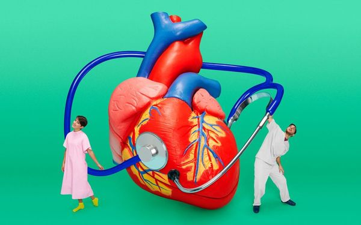
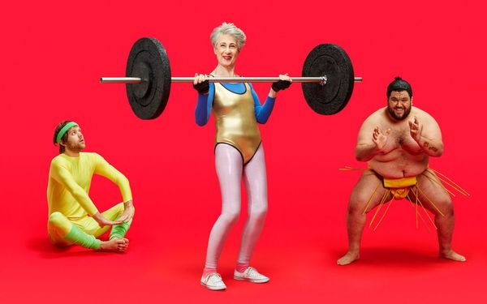
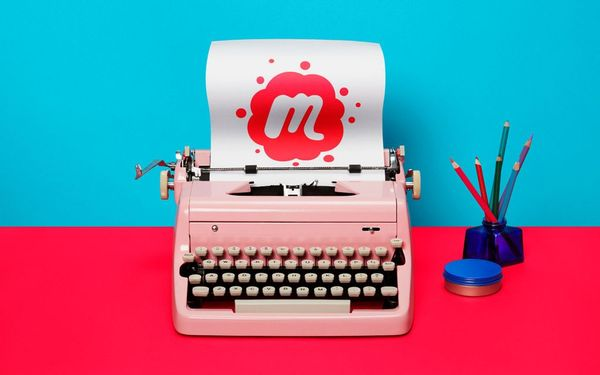
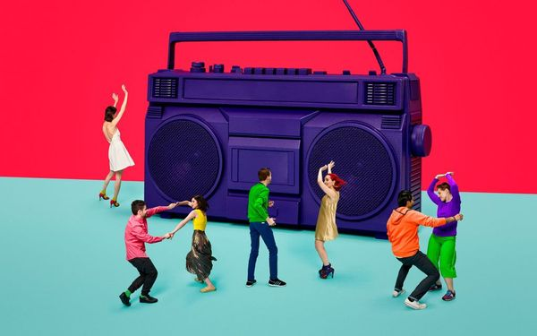
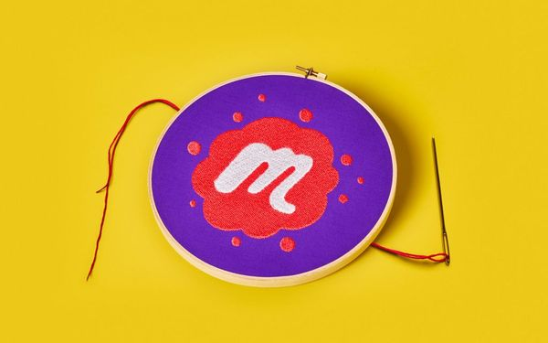
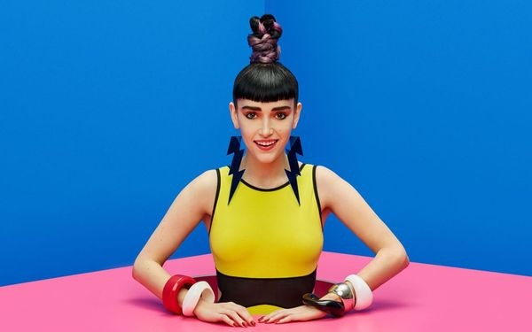

[//]: # (This content calls for a unique layout, so most of the content is written in HTML instead of Markdown.)
[//]: # (We can revisit this if we ever switch to a more robust CMS)

	

		
<h2 class="text--big">Logo</h2>

		
<a href="#" class="link">Download all logos</a>

	

	

		

			

				
			

			

				

					<h4 class="text--bold">Red script</h4>
				

				
					<a href="../../assets/contentImages/brandAssets/scriptLogo_red.svg" download="scriptLogo_red.svg">SVG</a>
				 |
					<a href="../../assets/contentImages/brandAssets/scriptLogo_red.png" download="scriptLogo_red.png">PNG</a>
				
			

		

	

	

		

			

				
			

			

				

					<h4 class="text--bold">Black script</h4>
				

				
					<a href="../../assets/contentImages/brandAssets/scriptLogo_black.svg" download="scriptLogo_black.svg">SVG</a>
				 |
					<a href="../../assets/contentImages/brandAssets/scriptLogo_black.png" download="scriptLogo_black.png">PNG</a>
				
			

		

	

	

		

			

				
			

			

				

					<h4 class="text--bold">White script</h4>
				

				
					<a href="../../assets/contentImages/brandAssets/scriptLogo_white.svg" download="scriptLogo_white.svg">SVG</a>
				 |
					<a href="../../assets/contentImages/brandAssets/scriptLogo_white.png" download="scriptLogo_white.png">PNG</a>
				
			

		

	

	

		

			

				
			

			

				

					<h4 class="text--bold">Red swarm with transparent "M"</h4>
				

				
					<a href="../../assets/contentImages/brandAssets/swarmLogo_knockout_red.svg" download="swarmLogo_knockout_red.svg">SVG</a>
				 |
					<a href="../../assets/contentImages/brandAssets/swarmLogo_knockout_red.png" download="swarmLogo_knockout_red.png">PNG</a>
				
			

		

	

	

		

			

				
			

			

				

					<h4 class="text--bold">Red swarm with white "M"</h4>
				

				
					<a href="../../assets/contentImages/brandAssets/swarmLogo_red.svg" download="swarmLogo_red.svg">SVG</a>
				 |
					<a href="../../assets/contentImages/brandAssets/swarmLogo_red.png" download="swarmLogo_red.png">PNG</a>
				
			

		

	

	

		

			

				
			

			

				

					<h4 class="text--bold">Black swarm with transparent "M"</h4>
				

				
					<a href="../../assets/contentImages/brandAssets/swarmLogo_knockout_black.svg" download="swarmLogo_knockout_black.svg">SVG</a>
				 |
					<a href="../../assets/contentImages/brandAssets/swarmLogo_knockout_black.png" download="swarmLogo_white.png">PNG</a>
				
			

		

	

	

		

			

				
			

			

				

					<h4 class="text--bold">Black swarm with white "M"</h4>
				

				
					<a href="../../assets/contentImages/brandAssets/swarmLogo_black.svg" download="swarmLogo_black.svg">SVG</a>
				 |
					<a href="../../assets/contentImages/brandAssets/swarmLogo_black.png" download="swarmLogo_black.png">PNG</a>
				
			

		

	

	

		

			

				
			

			

				

					<h4 class="text--bold">White swarm logo</h4>
				

				
					<a href="../../assets/contentImages/brandAssets/swarmLogo_knockout_white.svg" download="swarmLogo_knockout_white.svg">SVG</a>
				 |
					<a href="../../assets/contentImages/brandAssets/swarmLogo_knockout_white.png" download="swarmLogo_knockout_white.png">PNG</a>
				
			

		

	

	

		

			

				<video src="../../assets/contentImages/brandAssets/swarmAnimation.mp4" autoplay loop>
					Sorry, your browser doesn't support embedded videos,
					but don't worry, you can still use the link below to
					download it!
				</video>
			

			

				

					<h4 class="text--bold">Animated swarm logo</h4>
				

				<a href="../../assets/contentImages/brandAssets/swarmAnimation.mp4" download="swarmAnimation.mp4">MP4</a>
			

		

	

---------------------------------------

## Category images
When listing all categories, put them in the order they appear below.

	

		

			

				
			

			

				

					<h4 class="text--bold">Outdoors &amp; Adventure</h4>
				

				<a href="../../assets/contentImages/categoryImages/outdoorsAdventure.jpg" download="outdoorsAdventure.jpg">Download hi-res</a>
			

		

	

	

		

			

				
			

			

				

					<h4 class="text--bold">Tech</h4>
				

				<a href="../../assets/contentImages/categoryImages/tech.jpg" download="tech.jpg">Download hi-res</a>
			

		

	

	

		

			

				
			

			

				

					<h4 class="text--bold">Family</h4>
				

				<a href="../../assets/contentImages/categoryImages/family.jpg" download="family.jpg">Download hi-res</a>
			

		

	

	

		

			

				
			

			

				

					<h4 class="text--bold">Health &amp; Wellness</h4>
				

				<a href="../../assets/contentImages/categoryImages/healthWellness.jpg" download="healthWellness.jpg">Download hi-res</a>
			

		

	

	

		

			

				
			

			

				

					<h4 class="text--bold">Sports &amp; Fitness</h4>
				

				<a href="../../assets/contentImages/categoryImages/sportsFitness.jpg" download="sportsFitness.jpg">Download hi-res</a>
			

		

	

	

		

			

				
			

			

				

					<h4 class="text--bold">Learning</h4>
				

				<a href="../../assets/contentImages/categoryImages/learning.jpg" download="learning.jpg">Download hi-res</a>
			

		

	

	

		

			

				
			

			

				

					<h4 class="text--bold">Photography</h4>
				

				<a href="../../assets/contentImages/categoryImages/photography.jpg" download="photography.jpg">Download hi-res</a>
			

		

	

	

		

			

				
			

			

				

					<h4 class="text--bold">Food &amp; Drink</h4>
				

				<a href="../../assets/contentImages/categoryImages/foodDrink.jpg" download="foodDrink.jpg">Download hi-res</a>
			

		

	

	

		

			

				
			

			

				

					<h4 class="text--bold">Writing</h4>
				

				<a href="../../assets/contentImages/categoryImages/writing.jpg" download="writing.jpg">Download hi-res</a>
			

		

	

	

		

			

				
			

			

				

					<h4 class="text--bold">Language &amp; Culture</h4>
				

				<a href="../../assets/contentImages/categoryImages/languageCulture.jpg" download="languageCulture.jpg">Download hi-res</a>
			

		

	

	

		

			

				
			

			

				

					<h4 class="text--bold">Music</h4>
				

				<a href="../../assets/contentImages/categoryImages/music.jpg" download="music.jpg">Download hi-res</a>
			

		

	

	

		

			

				
			

			

				

					<h4 class="text--bold">Movements</h4>
				

				<a href="../../assets/contentImages/categoryImages/movements.jpg" download="movements.jpg">Download hi-res</a>
			

		

	

	

		

			

				
			

			

				

					<h4 class="text--bold">LGBTQ</h4>
				

				<a href="../../assets/contentImages/categoryImages/lgbtq.jpg" download="lgbtq.jpg">Download hi-res</a>
			

		

	

	

		

			

				
			

			

				

					<h4 class="text--bold">Film</h4>
				

				<a href="../../assets/contentImages/categoryImages/film.jpg" download="film.jpg">Download hi-res</a>
			

		

	

	

		

			

				
			

			

				

					<h4 class="text--bold">Sci-Fi &amp; Games</h4>
				

				<a href="../../assets/contentImages/categoryImages/scifiGames.jpg" download="scifiGames.jpg">Download hi-res</a>
			

		

	

	

		

			

				
			

			

				

					<h4 class="text--bold">Beliefs</h4>
				

				<a href="../../assets/contentImages/categoryImages/beliefs.jpg" download="beliefs.jpg">Download hi-res</a>
			

		

	

	

		

			

				
			

			

				

					<h4 class="text--bold">Arts</h4>
				

				<a href="../../assets/contentImages/categoryImages/arts.jpg" download="arts.jpg">Download hi-res</a>
			

		

	

	

		

			

				
			

			

				

					<h4 class="text--bold">Book Clubs</h4>
				

				<a href="../../assets/contentImages/categoryImages/bookClubs.jpg" download="bookClubs.jpg">Download hi-res</a>
			

		

	

	

		

			

				
			

			

				

					<h4 class="text--bold">Dance</h4>
				

				<a href="../../assets/contentImages/categoryImages/dance.jpg" download="dance.jpg">Download hi-res</a>
			

		

	

	

		

			

				
			

			

				

					<h4 class="text--bold">Pets</h4>
				

				<a href="../../assets/contentImages/categoryImages/pets.jpg" download="pets.jpg">Download hi-res</a>
			

		

	

	

		

			

				
			

			

				

					<h4 class="text--bold">Hobbies &amp; Crafts</h4>
				

				<a href="../../assets/contentImages/categoryImages/hobbiesCrafts.jpg" download="hobbiesCrafts.jpg">Download hi-res</a>
			

		

	

	

		

			

				
			

			

				

					<h4 class="text--bold">Fashion &amp Beauty</h4>
				

				<a href="../../assets/contentImages/categoryImages/fashionBeauty.jpg" download="fashionBeauty.jpg">Download hi-res</a>
			

		

	

	

		

			

				
			

			

				

					<h4 class="text--bold">Social</h4>
				

				<a href="../../assets/contentImages/categoryImages/social.jpg" download="social.jpg">Download hi-res</a>
			

		

	

	

		

			

				
			

			

				

					<h4 class="text--bold">Career &amp; Business</h4>
				

				<a href="../../assets/contentImages/categoryImages/careerBiz.jpg" download="careerBiz.jpg">Download hi-res</a>
			

		

	

